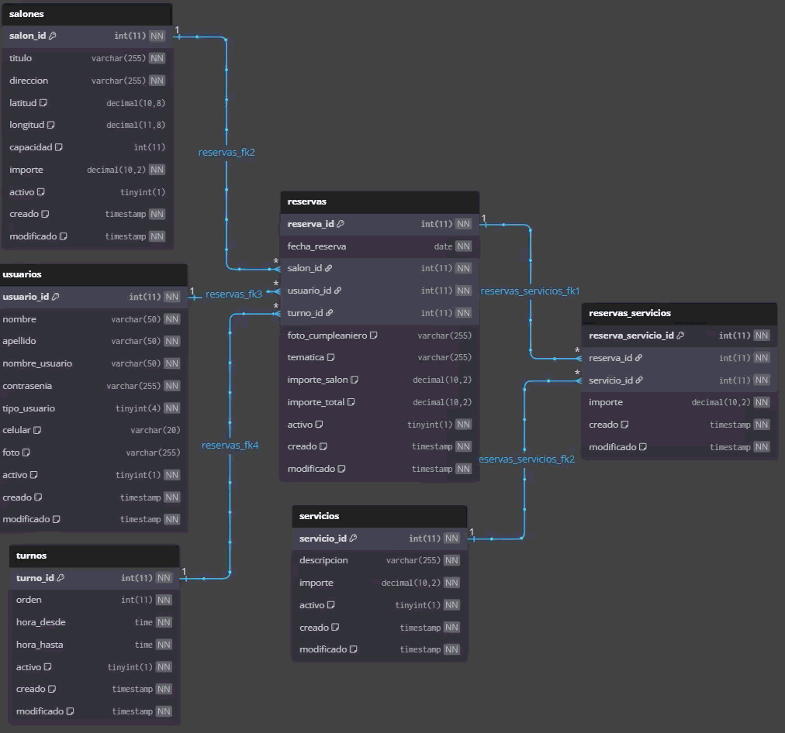
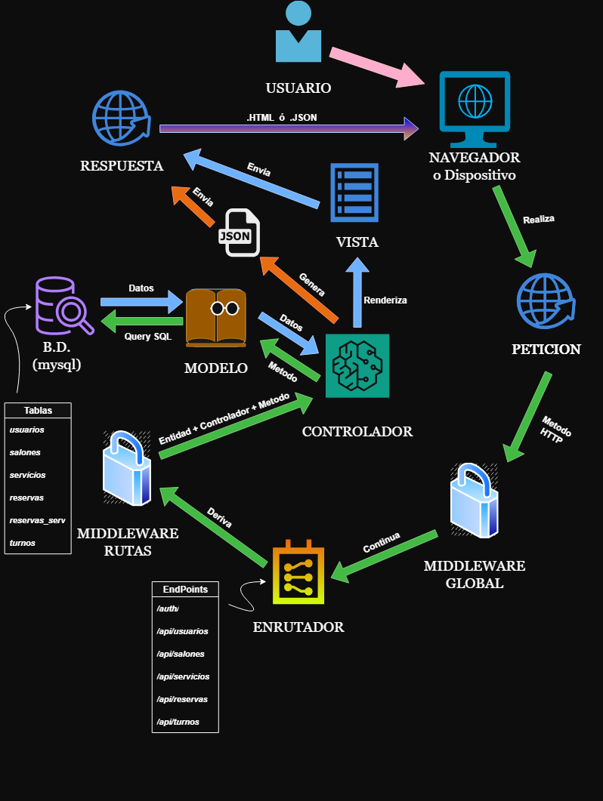
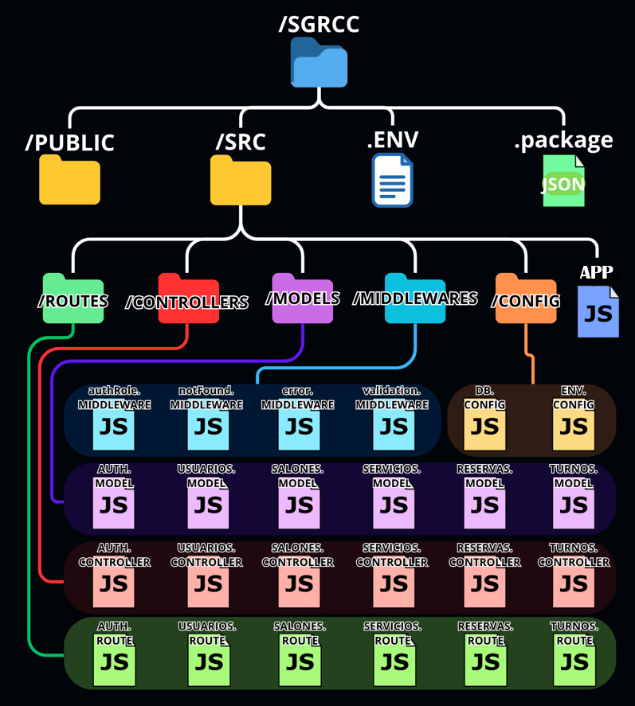

# 🎉 Sistema de Gestión de Reservas de Salones de Cumpleaños

<p align="center">
  
  
  
  
</p>

<details open>
  <summary>📌 1. Introducción</summary>
  
  # 📌 1. Introducción

 <p align="center">
    
  </p>


  <p align="center"> ----------------------------- TRABAJO FINAL INTEGRADOR -----------------------------</p>
  <p align="center"> -------------------- PROGRAMACIÓN III - 2025 | 2do cuatrimestre -------------------- </p>
  <p align="center"> ---------------- TECNICATURA UNIVERSITARIA EN DESARROLLO WEB ---------------- </p>


  👥 **Integrantes:**  
  
  - 👉[Moyano, Laura](https://github.com/laura-m-stack)     
  - 👉[López Nieto, Ileana](https://github.com/IleanaNieto)
  - 👉[Jerez, Pablo Agustin](https://github.com/punkscode)     
  - 👉[Delgado Coman, Santiago](https://github.com/delgados-coder)

  📅 **Fechas de entrega:**  
  - ✅ *Primera entrega (avance funcional mínimo):* **09/10/2025** → BREAD completo de alguna entidad del API con buenas prácticas.
  - 🚀 *Entrega final (versión completa):* **06/11/2025**  → Con todos los requerimientos.  
  - 🔄 *Recuperatorio de entrega final:* **18/11/2025**  → Con todos los requerimientos.

---

</details>

<details>
  <summary>📥 2. Instrucciones</summary>
  
  # 📥 2. Instrucciones
  
  ##### Clonar el repositorio

```
   git clone https://github.com/delgados-coder/SGRCC_P3_private.git
```
  ##### Entrar al proyecto
```
  cd SGRCC_P3_private
```
  ##### Instalar dependencias (Terminal A)
```
  npm install
```

  ##### Ejecutar la creacion de la Base de Datos (Terminal A)
```
  npm run db
```
  ##### Ejecutar el Servido en desarrollo (Terminal A)
  ```
  npm run dev
```

  ##### Ejecutar el Cliente de Prueba (Terminal B)
  ```
  npm run client
```

---

</details>


<details>
  <summary>📖 3. Trabajo Integrador</summary>
  
  # 📖 3. Trabajo Integrador
  
  #### 📝 Enunciado: 
  La empresa para la que usted trabaja ha inaugurado una nueva unidad de negocios llamada **“PROGIII”**.  
  Debido a su excelente desempeño en proyectos anteriores (ej. sistema de *Gestión de Reservas de Casas de Cumpleaños*), ha sido asignado al equipo responsable de diseñar y desarrollar la **API REST** que se integrará con un cliente web previamente desarrollado.  

  La API deberá contemplar **autenticación, autorización y validación de datos** para la **gestión de reservas de salones de cumpleaños**.  

  #### 🎯 Objetivos:
  - Poner en práctica todos los conocimientos adquiridos.  
  - Definir estructura de documentos y relaciones.  
  - Interactuar con una API REST intercambiando información.  

## ⚙️ Requisitos Funcionales:

#### 🔑 Roles y permisos:
###### 👤 Cliente:
- Iniciar sesión (autenticación).  
- Crear y listar reservas.  
- Listar **Salones, Servicios, Turnos**.  
- Recibir notificaciones automáticas al confirmar reserva.  

###### 🧑‍💼 Empleado:
- Iniciar sesión (autenticación).  
- Listar **Reservas y Clientes**.  
- BREAD completo para **Salones, Servicios, Turnos**.  

###### 👨‍💻 Administrador:
- Iniciar sesión (autenticación).  
- BREAD completo para **Reservas, Salones, Servicios, Turnos, Usuarios**.  
- Generar **informes estadísticos** mediante *stored procedures*.  
- Exportar reportes de reservas en **PDF – CSV – otros (no JSON)**.  
- Recibir notificaciones automáticas al generarse una reserva.  

---

### 🛠️ Aspectos Técnicos Requeridos:
- 🔐 Autenticación con **JWT**  
- 👥 Autorización por **roles**  
- ⚡ Framework **Express**  
- 🗄️ Persistencia en **MySQL**  
- 🚨 Manejo de errores y **respuestas HTTP apropiadas**  
- 📑 Documentación con **Swagger**  
- ✅ Validaciones con **express-validator**  

---

### 📏 Restricciones y Reglas de Negocio:
- 🔒 Solo **administrador** puede modificar reservas.  
- 📊 Estadísticas generadas únicamente con **stored procedures**.  
- 📝 Reportes en PDF deben incluir **reservas + servicios + salón + turno + cliente**.  
- ❌ Los *delete* serán **soft delete** (campo `activo`).  

---

### 🗃️ Modelo de Datos:
```
| **Tabla**               | **Campos**                                                                                                                                               |
| ----------------------- | -------------------------------------------------------------------------------------------------------------------------------------------------------- |
| salones                 | salon_id, titulo, direccion, latitud, longitud, capacidad, importe, creado, modificado, activo                                                           |
| servicios               | servicio_id, descripcion, importe, creado, modificado, activo                                                                                            |
| turnos                  | turno_id, orden, hora_desde, hora_hasta, creado, modificado, activo                                                                                      |
| reservas                | reserva_id, fecha_reserva, salon_id, usuario_id, turno_id, foto_cumpleaniero, tematica, importe_salon, importe_total, creado, modificado, activo         |
| reservas_servicios      | reserva_servicio_id, reserva_id, servicio_id, importe, creado, modificado                                                                                |
| usuarios                | usuario_id, nombre, apellido, nombre_usuario, contrasenia, tipo_usuario, celular, foto, creado, modificado, activo                                       |

```

---

### 🌟 Funcionalidades Extra (opcional):
- Encuestas de satisfacción post-evento.  
- Comentarios/observaciones de empleados/admins.  
- Reinicio de contraseña.  
- Dashboard de estadísticas.  
- Recordatorios automáticos al cliente (24hs antes).  
- Sistema de auditoría (acciones por usuario).  
- Registro de clientes e invitados.  

---

</details>


<details>
  
<summary>🧩 4.Resolución </summary>

# 🧩 4.Resolución

### 📦 Módulos Utilizados

<details>
  
<summary> ←VER→ </summary>

```
bcryptjs
cors
express
express-validator
jsonwebtoken
morgan
mysql2
swagger-jsdoc
swagger-ui-express
nodemon
pdfkit
```

</details>

### 🗺️ Diagrama de Entidades

<details>
  
<summary> ←VER→ </summary>



</details>

### ⚙️ Flujo De Trabajo

<details>
  
<summary> ←VER→ </summary>



</details>

### 🏗️ Estructura del Proyecto
Arquitectura **MVC** con **Express + MySQL2**.  

<details>
<summary> ←VER→ </summary>



```
📦 SGRCC_private          # Proyecto principal
 ┣ 📂src                  # Código fuente
 ┃ ┣ 📂config             # ⚙️ Configuración global
 ┃ ┃ ┣ 📜db.config.js     # 🗄️ Configuración de la base de datos
 ┃ ┃ ┗ 📜env.config.js    # 🌍 Variables de entorno
 ┃ ┣ 📂controllers        # 🎮 Controladores (lógica de negocio)
 ┃ ┃ ┣ 📜auth.controller.js        # 🔑 Autenticación y login
 ┃ ┃ ┣ 📜reservas.controller.js       # 📅 Reservas
 ┃ ┃ ┣ 📜salones.controller.js        # 🏢 Salones
 ┃ ┃ ┣ 📜servicios.controller.js      # 🛎️ Servicios
 ┃ ┃ ┣ 📜turnos.controller.js         # ⏰ Turnos
 ┃ ┃ ┗ 📜usuarios.controller.js       # 👤 Usuarios
 ┃ ┣ 📂middlewares        # 🛡️ Middlewares (validaciones y seguridad)
 ┃ ┃ ┣ 📜authRole.middleware.js   # 🔒 Autenticación de rutas y roles
 ┃ ┃ ┣ 📜error.middleware.js      # ❌ Manejo de errores
 ┃ ┃ ┣ 📜notFound.middleware.js   # 🚫 Rutas no encontradas
 ┃ ┃ ┗ 📜validation.middleware.js # ✅ Validaciones de datos
 ┃ ┣ 📂models             # 🗂️ Modelos (estructuras de la BD)
 ┃ ┃ ┣ 📜reservas.model.js        # 📅 Reservas
 ┃ ┃ ┣ 📜salones.model.js         # 🏢 Salones
 ┃ ┃ ┣ 📜servicios.model.js       # 🛎️ Servicios
 ┃ ┃ ┣ 📜turnos.model.js          # ⏰ Turnos
 ┃ ┃ ┗ 📜usuarios.model.js        # 👤 Usuarios
 ┃ ┣ 📂routes             # 🛣️ Rutas (endpoints de la API)
 ┃ ┃ ┣ 📜auth.routes.js           # 🔑 Autenticación
 ┃ ┃ ┣ 📜reservas.routes.js       # 📅 Reservas
 ┃ ┃ ┣ 📜salones.routes.js        # 🏢 Salones
 ┃ ┃ ┣ 📜servicios.routes.js      # 🛎️ Servicios
 ┃ ┃ ┣ 📜turnos.routes.js         # ⏰ Turnos
 ┃ ┃ ┗ 📜usuarios.routes.js       # 👤 Usuarios
 ┃ ┗ 📜app.js             # 🚀 Punto de entrada de la aplicación
 ┣ 📜.env                 # 🌍 Variables de entorno
 ┣ 📜.gitignore           # 🙈 Archivos ignorados por git
 ┣ 📜comandos.sql         # 🗄️ Scripts SQL de base de datos
 ┣ 📜package.json         # 📦 Dependencias y scripts de Node.js
 ┗ 📜README.md            # 📖 Documentación del proyecto

```

</details>

### 🔗 Endpoints:
<details>
<summary> ←VER→ </summary>
  
## Endpoints de la API

### Autenticación

| **Método** | **Ruta**                          | **Descripción**                                      |
|------------|------------------------------------|------------------------------------------------------|
| **POST**   | /auth/login                        | Iniciar sesión                                       |
| **POST**   | /auth/register                     | Registrar un nuevo usuario                           |

---

### Usuarios

| **Método** | **Ruta**                          | **Descripción**                                      |
|------------|------------------------------------|------------------------------------------------------|
| **GET**    | /api/usuarios                      | Lista todos los usuarios                             |
| **GET**    | /api/usuarios/:id_usuario          | Obtiene un usuario por su ID                         |
| **POST**   | /api/usuarios                      | Añadir un nuevo usuario                              |
| **PUT**    | /api/usuarios/:id_usuario          | Edita un usuario por su ID                           |
| **DELETE** | /api/usuarios/:id_usuario          | Elimina un usuario por su ID                         |

---

### Salones

| **Método** | **Ruta**                          | **Descripción**                                      |
|------------|------------------------------------|------------------------------------------------------|
| **GET**    | /api/salones                       | Lista todos los salones                              |
| **GET**    | /api/salones/:id_salon             | Obtiene un salón por su ID                           |
| **POST**   | /api/salones                       | Añadir un nuevo salón                               |
| **PUT**    | /api/salones/:id_salon             | Edita un salón por su ID                             |
| **DELETE** | /api/salones/:id_salon             | Elimina un salón por su ID                           |

---

### Servicios

| **Método** | **Ruta**                          | **Descripción**                                      |
|------------|------------------------------------|------------------------------------------------------|
| **GET**    | /api/servicios                     | Lista todos los servicios                            |
| **GET**    | /api/servicios/:id_servicio        | Obtiene un servicio por su ID                        |
| **POST**   | /api/servicios                     | Añadir un nuevo servicio                             |
| **PUT**    | /api/servicios/:id_servicio        | Edita un servicio por su ID                          |
| **DELETE** | /api/servicios/:id_servicio        | Elimina un servicio por su ID                        |

---

### Turnos

| **Método** | **Ruta**                          | **Descripción**                                      |
|------------|------------------------------------|------------------------------------------------------|
| **GET**    | /api/turnos                        | Lista todos los turnos                               |
| **GET**    | /api/turnos/:id_turno              | Obtiene un turno por su ID                           |
| **POST**   | /api/turnos                        | Añadir un nuevo turno                                |
| **PUT**    | /api/turnos/:id_turno              | Edita un turno por su ID                             |
| **DELETE** | /api/turnos/:id_turno              | Elimina un turno por su ID                           |

---

### Reservas

| **Método** | **Ruta**                          | **Descripción**                                      |
|------------|------------------------------------|------------------------------------------------------|
| **GET**    | /api/reservas                      | Lista todas las reservas                             |
| **GET**    | /api/reservas/:id_reserva          | Obtiene una reserva por su ID                        |
| **POST**   | /api/reservas                      | Añadir una nueva reserva                             |
| **PUT**    | /api/reservas/:id_reserva          | Edita una reserva por su ID                          |
| **DELETE** | /api/reservas/:id_reserva          | Elimina una reserva por su ID                        |
  
  
</details>
  
---

</details>


